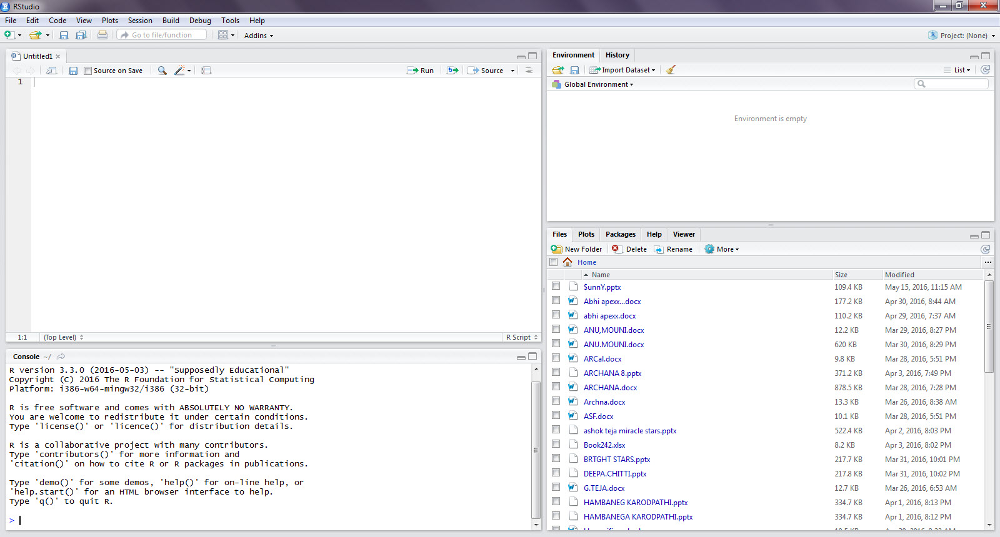

# Flux 

An application architecture for React

---

### Flux Design

- Dispatcher: Manages Data Flow
- Stores: Handle State & Logic
- Views: Render Data via React

---


---
## R Markdown

This is an R Markdown document. Markdown is a simple formatting syntax for authoring HTML, PDF, and MS Word documents. For more details on using R Markdown see <http://rmarkdown.rstudio.com>.

When you click the **Knit** button a document will be generated that includes both content as well as the output of any embedded R code chunks within the document. You can embed an R code chunk like this:
---

```
summary(cars)
```

```
##      speed           dist       
##  Min.   : 4.0   Min.   :  2.00  
##  1st Qu.:12.0   1st Qu.: 26.00  
##  Median :15.0   Median : 36.00  
##  Mean   :15.4   Mean   : 42.98  
##  3rd Qu.:19.0   3rd Qu.: 56.00  
##  Max.   :25.0   Max.   :120.00
```
---

## Including Plots

You can also embed plots, for example:

<!-- -->

Note that the `echo = FALSE` parameter was added to the code chunk to prevent printing of the R code that generated the plot.
---

# 2.Getting Started with R
# 2.1.	R programming

<!-- more -->
## Introduction
In this chapter we will understand 
  
* History, evolution and features of R  
  
* Installation of built-in R Console and R Studio IDE(integrated development environment)   
  
* understanding the basic structure, syntax, operators, and various datatypes of R programming  
  
* Familiar with data structures like vectors, dataframes, matrices, arrays, lists in addition with various utilities like functions and packages  

---
## History

R is a dialect of the language called S (an internal statistical analysis environment-originally implemented as Fortran libraries). S language has been principally developed by John Chambers and others at old Bell Telephone Laboratories, originally part of AT&T Corp in 1976.  

In the early 1990s, two faculty members named Ross Ihaka and Robert Gentleman (Statistics Department of the University of Auckland, NZ) initiated as a research project, developed it and called their programming language name as R. Since 1997, R has been developed by the R Development Core Team.  
In February 29, 2000, R version 1.0.0 was released, and since then various extensions have been made available. So many statisticians, bioinformaticians, quantitative analysts, data scientists and others contributed by donating their code, bugs fixing and helped for documentation. It's primarily a statistical environment for data analysis, statistical computing, and graphics.  

---
## Features

* R is a general purpose functional programming language:  
In other words R language is designed to be used for writing in a wide variety of application domains (a general-purpose), contrast to domain-specific programming languages which are designed to be used within a specific application domain. It's also typically uses fixed expressions for each function

* R is an interpreted language:  
In other words it's a programming language for which most of its implementations execute instructions directly, no need of previously compiling the program into machine-language instruction so that we can spend less time to writing the code
    
* R is open source & freely available:  
in other words anyone can use, copy, study, and change the software in any way, and the source code is also openly shared so that anyone who is interested can voluntarily improve the design of the software. unlike to proprietary software, where the software is under restrictive copyright and the source code is generally hidden from the users.
    
* R has Vibrant community & thousands of user-developed packages:  
in other words these are the user contributed code with a collections of R functions which contains some data with compiled code to do a particular task. Some of these packages are useful to manipulate , visualize or load data from external database and to create interactive web applications or  dynamic documents, presentations, and reports

* Analyzing very large scale data:  
R is not a software to be designed for storing the data, but it can analyze both structured and unstructured data. R can help us to perform descriptive analytics. It's also an excellent tool for building predictive models. Even though R is typically in memory bound and single threaded which seems to be daunting, but it supports deep integration with high performing programming languages conjunction with RDBMS, and other big data storage, processing tools. The advancement of currently available and ongoing development of powerful data handling packages which acts like APIs can help us to overcome these limitations.

* Other features include:   
R language is very simple, flexible and intuitive with reproducible scripts. It's also a powerful tool for data mining, visualization and machine learning. R becomes an essential tool for solving real world business problems like forecasting, trading, finance, marketing trends, risk assessment, biotechnology, drug development, climate models, social networking and many more
---
 

## Installation & Understanding Layout  

In order to work on R programming first we need to install a built-in R console 

**Built-in R console:** It is a tool which has console window acts as a command line interface where we can do everything with commands and it also has basic GUI features in the form of menu items.

**R Studio:** R Studio is a software tool which is an IDE for R programming with Rich GUI features for programming. It is available as open source & commercial editions on the desktop for various platforms, also in the form of R Studio Server and accessed over the web browser.

**Additional features of R-Studio compare to Built-in R console:  **Syntax highlighting, code completion, easy navigation to files & function definitions, interactive debugging features, supports to Git, Sub-version, powerful authoring (HTML, PDF, Word Documents, and slide presentations) and supports interactive graphics with Shiny and ggvis
  
Note: we have also other front-end GUI Tools like Rattle, RCommander, RKWard, JGR (Java Gui for R) for R programming, among all those R-studio is most widely used tool for R.
  
The instructions below are for installing R on Windows PC. If you want to install R on a computer that has other operating system like Macintosh or computer running Linux, you should download the appropriate R installer for that operating system at http://ftp.heanet.ie/mirrors/cran.r-project.org and follow the R installation instructions for the appropriate operating system at http://ftp.heanet.ie/mirrors/cran.r-project.org/doc/FAQ/R-FAQ.html#How-can-R-be-installed_003f
---
### Install R on Windows   
<br /> 
Go to Comprehensive R Archive Network (CRAN) website [https://cran.r-project.org/](https://cran.r-project.org/)
 <br /> 
 
  
 <br /><br /><br />
  
Select the link based on your operating system
<br />
  
    
 <br /><br /><br />                                                                                                                                                       
Click on the link install R for the first time
<br />
  
  
<br /><br /><br /> 
  
Click on the link Download R for Windows (Here the version is R 3.3.0, it may be latest version while installing)
<br />
  
  
<br /><br /><br /> 
  
  
<br /><br /><br /> 

After installation completed click on Run Button  
<br />

  
<br /> <br /> <br /> 
  
Select the language you want to prefer  
<br />


<br /> <br /> <br /> 
  
Click on Next Button
<br /> 
  
  
<br /> <br /> <br /> 
  
Read GNU General Public Licence Agreement and accept it by click on Next Button  
<br /> 

  
<br /> <br /> <br /> 

Change the location if you want to install R on different folder or Leave as it is if you prefer same location
<br /> 

  
<br /> <br /> <br /> 

Select the components either 32 bit or 64 bit or both based on your operating system 
<br /> 

  
<br /> <br /> <br /> 

You can customize the start up by selecting yes radio button (by default it is no)
<br /> 

  
<br /> <br /> <br /> 

Select either MDI((multiple child windows in one big window) or SDI(separate windows) 
<br /> 

  
<br /> <br /> <br /> 

Select Help style as either HTML help or plain text. Html help would be more preferable  
<br /> 

  
<br /> <br /> <br /> 

Select the start menu folder to setup program's shortcut. Leave as it is if you don't prefer other folder
<br />

  
<br /> <br /> <br /> 

Select Additional tasks like icons or registry entries or leave it as default options  
<br />

  
<br /> <br /> <br /> 

Wait for installation to complete  
<br /> 

  
<br /> <br /> <br /> 

Click on Finish Button to complete the installation process  
<br /> 

  
<br /> <br /> <br /> 

Finally R will be displayed as Desktop shortcut icon and/or start menu item 
<br />

  
<br /> <br /> <br /> 

Once click on the shortcut icon/menu item, you will get a R console window  
<br />

 
<br /> <br /> <br /> 

Write any commands after the greater than symbol (>) where the cursor is blinking

<br /><br /><br />
<br /><br /><br /><br />  
  
#### Layout of R-Console  
  
 
<br /> <br /> <br /> 

### Install R-Studio IDE for Windows

Goto R-Studio website [https://www.rstudio.com/](https://www.rstudio.com/)
<br />

  
<br /><br /><br />

Click on Products menu  

  
<br /><br /><br />

There are two types of versions available 1) Desktop(standalone) 2) server(browser based interface to Run R on a remote Linux server for Centralized accessing and computation)

In this example Download R Studio desktop version has been chosen for windows operating system  

  
<br /><br /><br />

  
<br /><br /><br />

Choose either single installer file, or archived zip folder based on the operating system of the machine  

  

  
<br /> <br /> <br /> 

After the complete installation,click on the installed file and choose Run Button  
<br />
  

Click on Next Button
<br />
  
<br /><br /><br />
Choose the destination folder
<br />
  
<br /><br /><br />
Choose start menu folder and click on Install button  
<br />
  
<br /><br /><br />

Wait until installation completed  
<br />
  
<br /><br /><br />
Click on Finish Button  
<br />
 
<br /><br /><br />
Check the desktop Icon 
<br />
 
<br /><br /><br />
Once click on desktop shortcut icon, the R-Studio window will be open
<br />
 
<br /><br /><br />    

#### Layout of R-Studio 
  
 
<br /><br /><br />
  
## Basic Structure of R 
explanation  
  
### Syntax

* R programming is case sensitive, which means for example a letter 'm' is not equal to 'M'
* Comments can be written by using # at the beginning of the statement 
* We can Run single/multiple lines of code. This is much more flexible because of it's interpreted nature 
* Script files are saved with .R extension, workspace saved with  .RData, code history saved with .Rhistory
* R has two assignment operators which can assign values into objects. less than symbol followed by the hyphen (<-) or Equal operator (=)

### Objects
R is an object oriented programming, Everything in R is an object and all objects have a class. R language does not provide direct access to the computer's memory but it provides a number of data structures (data frames, vectors, arrays, matrices,...) those are called as objects. These objects acts like a placeholder for different types. Objects also termed as symbols or variables. Here symbols also manipulated in the same way as any other object. this feature is contrast to any other programming languages; There is a mode function that will tell you the mode of an object, means what kind of object they are and one more function type of which tells more specific about an object.  
During computations R objects can coerced to different types. Various functions available in R language to perform explicit coercion. In R programming language the type of an object doesn't affect much on the computations  

### Basic data types
Unlike other programming languages in R, the variables are not declared as any data type. The variables are assigned with some R Objects and then the data type of the object becomes the data type of the variable. Following are the six basic data types, which are called as atomic data types.  

Data Type | Example
--- | --- 
Numeric	| 52.5, 702, 999.63
Integer	 | 5L, 51L, 0L	
Logical | TRUE, FALSE or T,F
Complex	| 5 + 6i
Character	  | 'u' , '"hai", "FALSE", '15.4'
Raw | 	"Hello!" my reservation number is: 105 5c 6f  


### Operators  
Operators are nothing but symbols which can be used to perform specific manipulations. R has built-in operators which can handle Arithmetic, Relational Logical and Assignment tasks  

Operator | Description | 
--- | --- 
+  | Plus
-  | Minus
*  | Multiplication
/  | Division
! | Not 
~ | Tilde 
? | Help 
: | Sequence 
^ | Exponentiation 
< | Less than 
> | Greater than 
== | Equal to 
>= | Greater than or equal to 
<= | Less than or equal to 
& | And
<- | assignment 
$ | List subset 
%% | Modulus 
%/% | Integer Division


### Functions
Functions can be defined as to take zero arguments or more arguments, Functions can return a value or result, Functions can be called by name with any number of arguments enclosed with in parentheses, Even some functions has no arguments. 

Calling Functions:  
A function call is an expressed as  
**function_name(arg1, arg2, arg3,....)**

**Example:**

```r
print(5) # to print any object which is specified with in the parentheses
sum(2,3) # this function is used to add the values with in the parentheses
```


**Default functions:  **  
these functions can provide by R program without any explicitly define by the programmer. They comes with installation of R software itself or some functions included in the packages which comes after installation of R packages  

**Examples: **

```r
getwd() # to get the current working directory
ls() #list out all objects in the session of R environment. if we don't have any objects it will return as character(0)
```

**User defined functions:  **  
we can create our own functions in R by using function definition
As the tasks become more complex, it is a good idea to put some logic in the form of  code into functions that perform certain tasks    
**function_name <- function(arg1, arg2, ... ){  **  
<br />**statements  **  
<br />**return(object)  **   
<br />**}  **  


### Packages  
Packages are the basic units of reproducible R code. Which can be developed by any R community users. These may include functions, data, and  other documentation.  

Installing and usage of packages:
Packages can be installed into R environment by **installed.packages("package_name")** Then we can use that package by using the function **Library(package_name)**  

**Example:**


```r
install.packages("fun")
library(fun)
```
## Data Structures of R programming
These are also called as compound data types which can store any atomic data type of values into them
  
### Vectors
The most basic data structure in R is the vector. vector is a sequence of data elements of the same data type.
these vectors contains any numerical, character, logical values in it. Vector can be created usually created using c(), seq(), or rep() 

Here is a vector containing three numeric values , and .

```r
a <- c(11,12,5.3,60,-2,14) # numeric vector 
b <- c("one","two","three") # character vector 
c <- c(TRUE,TRUE,TRUE,FALSE,TRUE,FALSE) #logical vector
d <- seq(1:10) 
print(d) #values from 1 to 10 by sequence 
```

```
##  [1]  1  2  3  4  5  6  7  8  9 10
```

```r
e <- rep("Hai",5) 
print(e) # the character string "Hai" can be printed 5 times
```

```
## [1] "Hai" "Hai" "Hai" "Hai" "Hai"
```

Index of vector: 
There are many ways to select a specific element or group of values from a vector. This is also known as indexing a vector and is done by using square brackets i.e [ ]


```r
b[2] #to access 2nd element of vector b
```

```
## [1] "two"
```

```r
a[2:5] #to access from 2nd element to 5th element of vector a
```

```
## [1] 12.0  5.3 60.0 -2.0
```

```r
b[-3] #exclude 3rd element
```

```
## [1] "one" "two"
```

```r
d[] # to access all the elements of vector d
```

```
##  [1]  1  2  3  4  5  6  7  8  9 10
```

### Matrices
All elements in the matrix must be of the same data type, means either character or numeric or logical. All columns in a matrix must have the same mode (numeric, character, etc.). these are nothing but two-dimensional (r X c) object (think a bunch of stacked or side-by-side vectors).They may be referred as two dimensional arrays

matrix can be defined by 
**mymatrix <- matrix( vector, nrow= r, ncol= c, byrow= FALSE, dimnames=list( char_vector_rownames, char_vector_colnames ))**

by default matrices can be displayed values in column wise, we can print row wise by using the argument **byrow = TRUE**

**Example: **


```r
myMatrix<-matrix(c(1,5,4,8,3,7,6,2), nrow=2,ncol=4) 
print(myMatrix) # it will print with 2 rows and 4 columns with specified values in the vector of first argument
```

```
##      [,1] [,2] [,3] [,4]
## [1,]    1    4    3    6
## [2,]    5    8    7    2
```

Index of Matrices: 

```r
myMatrix[,4] # 4th column of matrix 
```

```
## [1] 6 2
```

```r
myMatrix[2,] # 2nd row of matrix 
```

```
## [1] 5 8 7 2
```

```r
myMatrix[,-3] # Excluding  3rd column of matrix 
```

```
##      [,1] [,2] [,3]
## [1,]    1    4    6
## [2,]    5    8    2
```

Matrix Algebra:  
We can add/subtract matrices by + or -  
multiply using %*%  
transpose by using t() function  

### Arrays
All elements in the array must be of the same data type, means either character or numeric or logical. An array refers to any number of dimensions in the form of (r X c X h) object (think a bunch  of stacked r X c matrices). 

Arrays can be defined by

**array(data = NA, dim = length(data), dimnames = NULL)**

**Examples: **

```r
myArray <- array(c("sun", "mon", "tue", "wed", "thu"), dim = c(2, 2, 3)) # 3 dimensional array with 2 rows and 2 columns with the elements specified in the vector of first argument
print(myArray)
```

```
## , , 1
## 
##      [,1]  [,2] 
## [1,] "sun" "tue"
## [2,] "mon" "wed"
## 
## , , 2
## 
##      [,1]  [,2] 
## [1,] "thu" "mon"
## [2,] "sun" "tue"
## 
## , , 3
## 
##      [,1]  [,2] 
## [1,] "wed" "sun"
## [2,] "thu" "mon"
```

indexting of Array: 


```r
myArray[,,2][2,1] # access the 2nd row of 1st column from the 2nd element of the array
```

```
## [1] "sun"
```


### Data Frame  
A data frame is a 2 dimensional matrix-like object where the columns can be of different classes/modes like numeric, character, factor, etc... It's more than a matrix.

For example, a data frame may contain    
* columns with characters  
* columns with integer numbers  
* columns with numeric values  
* columns with date values  

**Example:  **

```r
myVect1 <- c(11,22,35,14) 
myVect2<- c("sun", "mon", "tue", NA) 
myVect3 <- c(TRUE,TRUE,TRUE,FALSE) 
myDataFrame <- data.frame(myVect1 ,myVect2,myVect3) 
View(myDataFrame) # to view the data frame  
names(myDataFrame) <- c("Number","Week","Present") # these are variable names 
```

There are a different ways to access the elements of a data frame  


```r
myDataFrame[3:2] # Retrieve columns 3,2 of a data frame 
```

```
##   Present Week
## 1    TRUE  sun
## 2    TRUE  mon
## 3    TRUE  tue
## 4   FALSE <NA>
```

```r
myDataFrame[c("Number","Week")] # Retrieve the columns whose names are Number and Week from data frame 
```

```
##   Number Week
## 1     11  sun
## 2     22  mon
## 3     35  tue
## 4     14 <NA>
```

```r
myDataFrame$Present # Access Present Variable from the data frame
```

```
## [1]  TRUE  TRUE  TRUE FALSE
```

### Lists  

Up to here we are familiar with Vectors, Matrices, Arrays and Data frames  

Vectors: The elements in a vector all have same data type either they are numeric, character or logical  

Matrices:  These are two dimensional arrays having all the elements of same data type   

Arrays:  an array refers to multiple dimensions with all the elements of same data type  

Data frames:  The columns have different data types like one column with characters one column with numeric, another column may be logical  

With help of those information we can create a List which is nothing but an ordered collection of various objects (like above). These objects even unrelated but framed under one name. These include vectors, matrices, arrays...Etc.  List can have a kind of master data type which can store any piece of information in it

**Example: **


```r
myList<- list(123, "John", TRUE)	# here the first argument is numeric, second argument is character, third argument is logical
myList1<-list(c(2,5,3), sin) # here the first argument is vector of three elements, second argument is trigonometric function
#Now let's take one matrix and one array
myMatrix <- matrix(c(5,9,7,6,4,10), nrow = 2, ncol = 3)
myArray <- array(c('green', 'yellow'),dim = c(3,3,2))
#Now we can create a list from all of the above including matrix and array
myList2  <- list(123, "John", TRUE, c(2,5,3), sin, myMatrix, myArray)
```

list operations: 


```r
myList # to print the list in console window
```

```
## [[1]]
## [1] 123
## 
## [[2]]
## [1] "John"
## 
## [[3]]
## [1] TRUE
```

```r
newList <- c(myList,myList1) #we can also combined two lists and stored in another list
unlist(newList) # It gives us total list structure. unlist simplifies and it to produce a vector which contains all the atomic components.
```

```
## [[1]]
## [1] 123
## 
## [[2]]
## [1] "John"
## 
## [[3]]
## [1] TRUE
## 
## [[4]]
## [1] 2
## 
## [[5]]
## [1] 5
## 
## [[6]]
## [1] 3
## 
## [[7]]
## function (x)  .Primitive("sin")
```

Indexing of lists:  

we can access the elements of a list using the [[]] 

```r
myList[1] # to print first element of the list i.e 123
```

```
## [[1]]
## [1] 123
```

```r
myList[[1]] # Same output as above
```

```
## [1] 123
```

```r
myList1[[1]][2] # to print second value of the first element(i.e a vector c(2,5,3)) which is nothing but 5  
```

```
## [1] 5
```

#### scatterplot

```r
plot(mtcars$mpg,mtcars$cyl)
```

<!-- -->

#### barplot

```r
barplot(table(table(mtcars$hp)),mtcars$cyl)
```

<!-- -->

